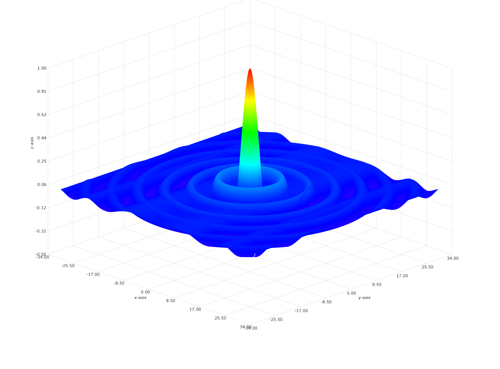
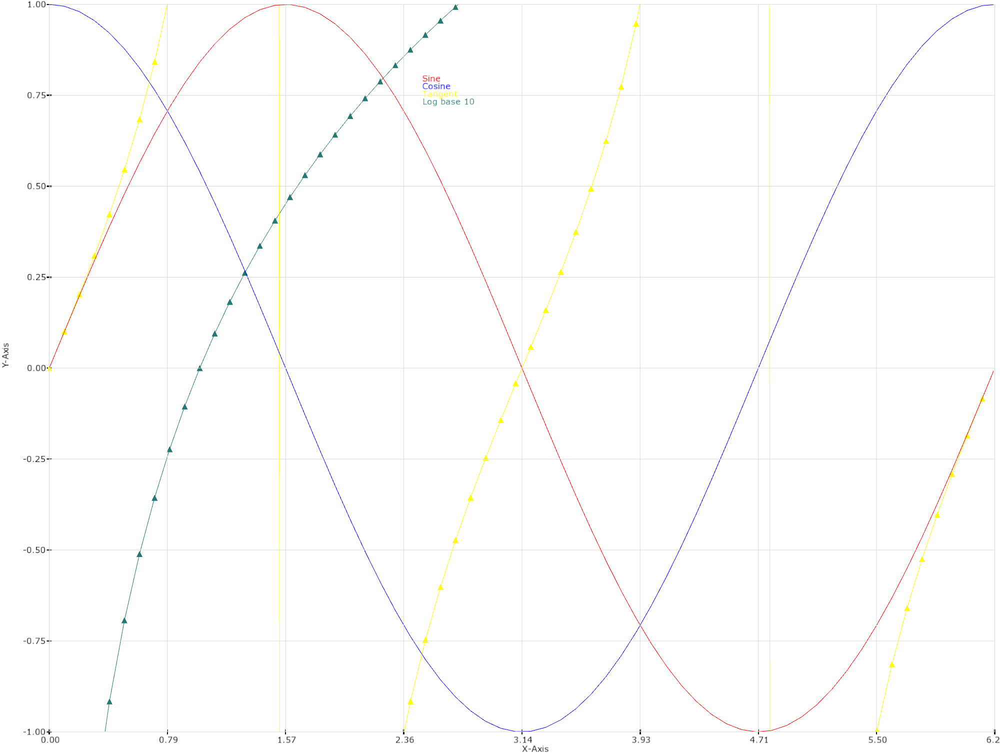
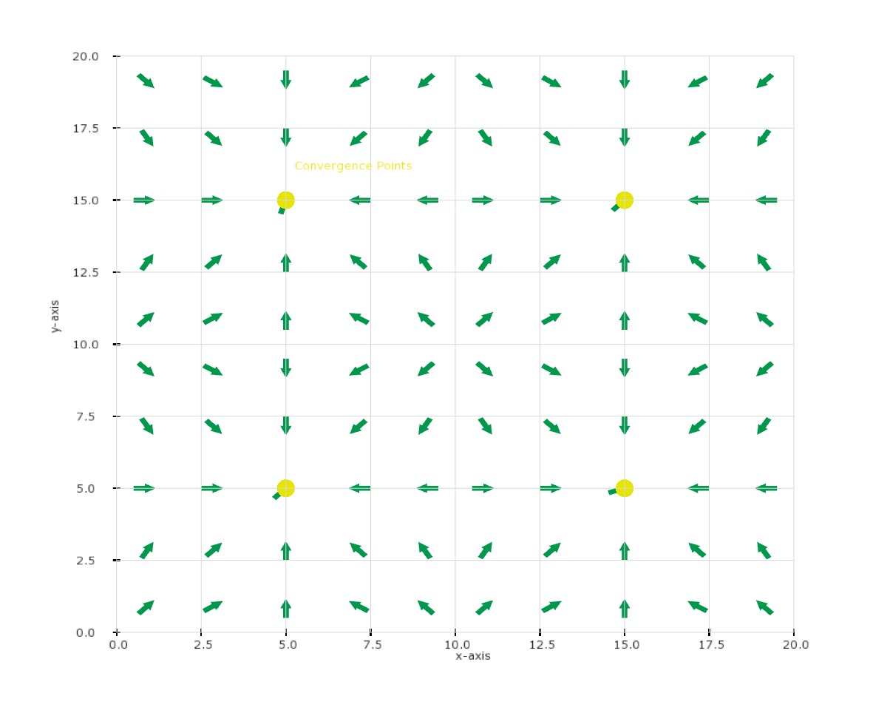
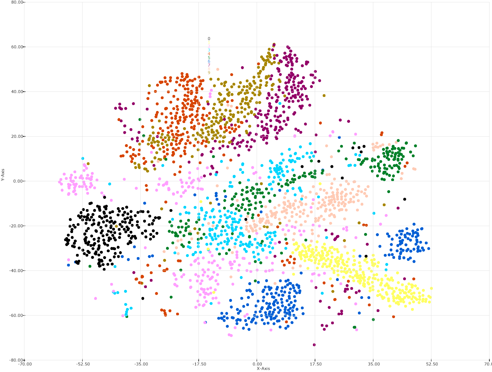

# Forge

📊  Julia wrapper for the [Forge](https://github.com/arrayfire/forge) library

### Forge.DSL

a DSL for the Forge.

```julia
using Forge.DSL

window = create_window(1024, 768, "3d Surface Demo")
show_window(window)

const XMIN = -32
const XMAX =  32
const YMIN = -32
const YMAX =  32
const DX = 0.25
const XSIZE = (XMAX-XMIN)/DX
const YSIZE = (YMAX-YMIN)/DX

chart = create_chart_3d()
set_axes_limits(chart, XMIN-2, XMAX+2, YMIN-2, YMAX+2, -0.5, 1)
set_axes_titles(chart, "x-axis", "y-axis", "z-axis")

surface = create_surface(chart, XSIZE, YSIZE)

data = []
for x in XMIN:DX:XMAX+DX, y in YMIN:DX:YMAX+DX
    z = sqrt(x*x + y*y) + 2.2204e-16
    push!(data, x, y, sin(z)/z)
end

update_vertex_buffer(surface, data)

draw_chart(!isclosed, window, chart)
```

### Examples
 [surface.jl](examples/surface.jl)
 

 [plotting.jl](examples/plotting.jl)
 

 [field.jl](examples/field.jl)
 

 [tsne.jl](examples/tsne.jl)
 
