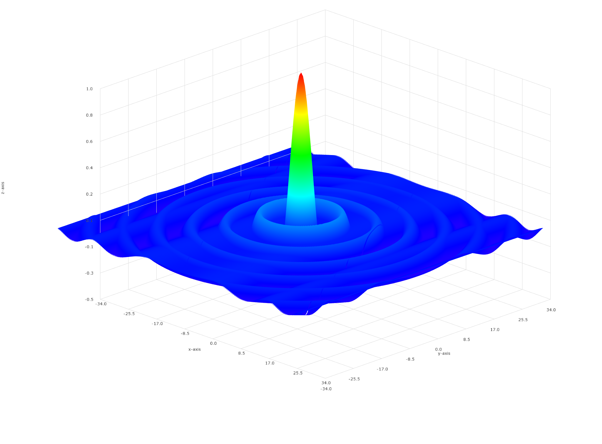
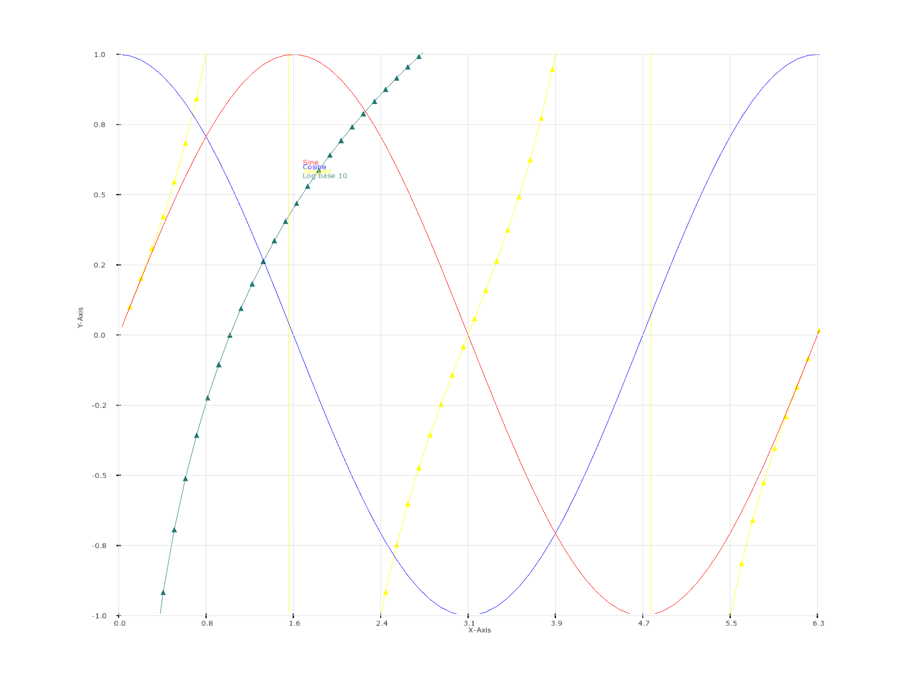
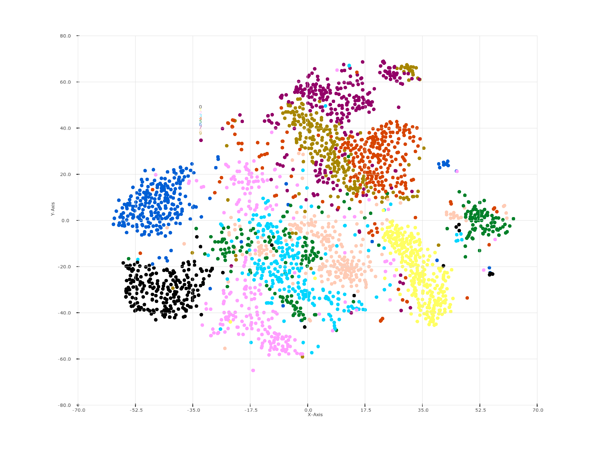

# Forge

📊  Julia wrapper for the [Forge](https://github.com/arrayfire/forge) library

### Forge.Smith

a DSL for the Forge.

```julia
using Forge.Smith

window = create_window(1024, 768, "3d Surface Demo")
show_window(window)

chart = create_chart_3d()
set_axes_limits(chart, XMIN-2, XMAX+2, YMIN-2, YMAX+2, -0.5, 1)
set_axes_titles(chart, "x-axis", "y-axis", "z-axis")

surface = create_surface(chart, XSIZE, YSIZE)
update_vertex_buffer(surface, data)

draw_chart(!isclosed, window, chart)
save_window_framebuffer(window, "surface.png")
```

### Examples
 [surface.jl](examples/surface.jl)
 

 [plotting.jl](examples/plotting.jl)
 

 [field.jl](examples/field.jl)
 

 [tsne.jl](examples/tsne.jl)
 
